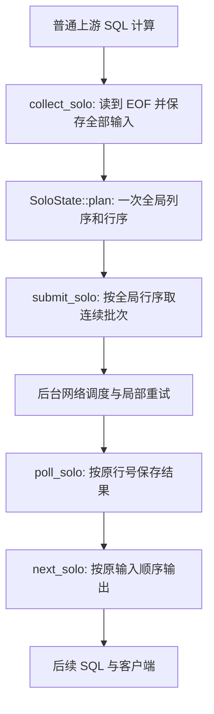

# AI Function、异步 Semantic Operators 与全局 SOLO 维护交接

更新日期：2026-10-08。适用基线：`0532d6e33`，`feat(sql): add global SOLO prompt reordering`。

本文面向接手实现、调试和回归测试的开发者，覆盖 AI Function 异步运行时及全阻塞 SOLO。这里的 SOLO 是数据库端的输入排列算法，不是推理服务端的 KV cache 实现。

## 1. 当前交付状态

| 能力 | 已实现的范围 |
| --- | --- |
| AI_COMPLETE | 每个有效 SQL 输入行对应独立 prompt；逐请求校验、重试、deadline 和取消 |
| AI_EMBED | 当前 SQL batch 内的原生多输入请求；按序列化大小拆分并按响应索引回填 |
| 跨批流水线 | AI_COMPLETE 与 AI_EMBED 共用可配置槽位、逻辑内存预算和后台网络调度 |
| SQL worker 释放 | 符合准入条件的单语句 AI 根算子查询可挂起并从保留状态恢复，不重新执行整条 SQL |
| 全局 SOLO | 收齐当前 AI 阶段的全部输入，完成一次列重排和行重排后才提交模型请求 |
| AI_MAP / AI_FILTER | 显式逻辑和物理算子；独立表达式并发、依赖感知的跨批推进、严格布尔过滤 |
| 语义 PX | 经校验的 reduce-transmit / semantic / GI / scan 路径保留任务状态并释放物理 worker；同一查询共享预算 |

旧 AI Function 与 SOLO 实现在上述基线提交中。本轮新增了 AI_MAP / AI_FILTER 和可恢复 PX 实现；下文保留旧路径的维护约束，不应把旧 SOLO 的单 worker 限制套到新接口上。

已有的 [RUNTIME_TESTS.md](../../../tools/deploy/mysql_test/test_suite/ai_function/RUNTIME_TESTS.md) 是运行契约、测试入口和历史验收记录。本文解释当前架构、维护约束和排障路径；行为或测试变更时，两份文档应一起更新。外层工作区另有历史执行能力补齐计划，但它不是本仓库依赖，也不应被当作最新 SOLO 规范。

关键历史提交：

| 提交 | 用途 |
| --- | --- |
| `0532d6e33` | 全局 SOLO 与相关验收；当前交接基线 |
| `5bfa9aaed` | 可恢复的多槽 AI 流水线与共享预算 |
| `b30697580` | 共享后台网络调度线程 |
| `183defcac` | AI Function 跨 SQL batch 流水线 |
| `5b2f000bb` | 原生 AI_EMBED batch 与资源测试 |

### 新接口：先理解执行顺序，再看并行

```sql
SELECT id, AI_MAP('classifier', prompt) AS category
FROM inputs
WHERE AI_FILTER('selector', prompt)
ORDER BY id;
```

这里数据库先调用 selector 判断每行，再只对保留下来的行调用
classifier。等第一批 classifier 时，可以继续做第二批 selector；两个互不依赖
的 AI_MAP 也可以一起发出。同一行里 `AI_MAP('b', AI_MAP('a', prompt))`
仍然要先有 a 的结果，但不要求所有批次依次等完。

AI_MAP 返回 LONGTEXT；AI_FILTER 只接受模型返回的 `{"value": true}` 或
`{"value": false}`，转换为 SQL 1/0。错误不能当成 false。`SELECT AI_FILTER(...)`
只是布尔投影，会保留 false 行，因此对应 SEMANTIC MAP；WHERE/HAVING 才把结果
用于筛行。CASE、AND、OR、NOT 继续遵守普通 SQL 的求值边界，不能为了并发提前调用
未选中的分支。

同一个 AI 表达式出现在 HAVING/ORDER BY 和 SELECT 中时，前面的阶段可能只算过
部分行，不能把“这个算子负责它”误当成“所有行都已经算完”。已算过的值随对应行
传递，后面的阶段直接复用；没算过的值只在真正需要的位置补算。尤其是 SELECT
投影要在 LIMIT 之后补算，不能先计算被丢弃行的模型请求或 prompt 参数。

实现使用显式 shared/carried 元数据：只有声明过的语义结果可以携带内部
“尚未请求”的 NULL 标记，正常 AI_MAP/AI_FILTER 结果不会是 SQL NULL。false 和
空字符串都是有效的已完成值；内部标记不能作为查询输出。依赖这些结果的 CPU
prompt 配方及条件 fallback 不当成完整输入列传递，而是在消费者的语义运行时中
按需重算。批次已初始化状态与每行完成位分开，补算一行不能清掉其他行的缓存。
完整 CASE/OR 条件已经算完，不代表它跳过的 CPU 分支也算完了；条件本身可以输出，
但被跳过的分支仍要保持延迟求值。

首版模型和配置必须是静态值；prompt 可以包含普通 SQL 运算、位置参数 AI_PROMPT
或前一个 AI 的结果。新接口不支持结构化全局 SOLO，也没有未接入算子时的同步
completion 退路。AI_FILTER 使用原有原生 `response_format.json_schema`：
固定必需布尔字段 value、禁止额外字段、strict=true。只有精确大小写的 Schema
是保留键；AI_FILTER 拒绝该键，匹配的原生格式和调用者非空名称可以原样使用，
冲突格式报错。AI_MAP 的 Schema 只是原有 provider 配置透传，不是新增简写。

#### 所有权、资源与恢复

- 每个执行上下文拥有自己的 SQL frame 和 readiness 列表；不同 PX 上下文不共享
  frame，只共享同一 execution ID 的 SemanticQueryBudget。
- 每个算子最多保留 `ai_pipeline_slots` 批输入。全查询最多在途
  `ai_pipeline_slots × 不同语义调用数` 个 client-batch，不乘 DOP。
  一个 completion client-batch 里仍是多条独立 HTTP 请求，不要混淆这两个数量。
- 保留的行、结果、prompt、模型名、静态配置和网络缓冲参与逻辑内存计账。
  配置每轮提交只准备一次，不按行保留重复 JSON；临时表达式/JSON、allocator
  开销等不构成全 RSS 限制。原有实例总预算及 4MiB 请求、8MiB 响应、
  64MiB client-batch 边界不变。
- SQL worker 会回收同一执行上下文内所有语义阶段已完成的任务，释放在途额度，
  但不会在回收回调中求值其他算子的 SQL frame。否则下游批槽已满时，上游已经
  返回的请求可能钉住全部额度，让下游一直等到 deadline。
- 若首次输入在上游批次仍被当前调用栈持有时放不进查询内存预算，则明确报配额
  错误，不等待当前调用栈无法释放的内存。这里是保守的配额策略，不是所有内存
  压力下都会自动降低并发。
- 不能在任意父算子中直接上传 pending。open 总是禁止挂起；未经验证、局部进度
  仍在栈上的父算子保守等待。这样的查询仍能跨批发请求，但不能据此宣称整条 SQL
  都会释放 worker。
- PX 首版只放行向量化 reduce-transmit → 连续 semantic map/filter → 可选 GI →
  scan/expr-values。rescan、sampling、shuffle/hybrid 和不安全 join/receive/
  blocking 祖先不放行。每个 PX pool 最多 64 个保留记录，不另建推理调度线程；
  挂起不 close、不报完成、不归还逻辑准入，真正结束才释放所有权。
- WHERE 语义过滤要在 LIMIT/Top-N 下推之前变成独立节点。语义 pair predicate
  不下推成可变 NLJ 参数。预取前保存整个 child datum frame，而不是只保存已返回的
  行：prefix sort 等父子组合可能仍持有后面的输入尾部。

新增源码入口：

| 入口 | 职责 |
| --- | --- |
| [ob_expr_ai_semantic.cpp](../../../src/sql/engine/expr/ob_expr_ai/ob_expr_ai_semantic.cpp) | 接口类型、严格布尔约束、静态参数和无同步退路 |
| [ob_log_semantic.cpp](../../../src/sql/optimizer/ob_log_semantic.cpp) | 语义计算归属；[规划入口](../../../src/sql/optimizer/ob_select_log_plan.cpp) 负责阶段放置 |
| [ob_semantic_op.cpp](../../../src/sql/engine/basic/ob_semantic_op.cpp) | 输入/结果所有权、按需表达式依赖、发送/轮询/跨批输出 |
| [ob_semantic_runtime.cpp](../../../src/sql/engine/basic/ob_semantic_runtime.cpp) | 查询共享预算、失败传播、readiness 与安全挂起范围 |
| [ob_px_worker.cpp](../../../src/sql/engine/px/ob_px_worker.cpp) | 保留 PX 上下文、逐 slice 恢复 TLS、取消和真实结束 |
| [ob_px_task_continuation_store.h](../../../src/observer/omt/ob_px_task_continuation_store.h) | 有界记录、ready-only 驱动、lease 与 shutdown |

真实私有 SQL 测试已经验证 8 分区、PARALLEL(4) 下同一 execution ID 的四个 task、
多个实际 CPU thread、预算不随 DOP 放大、精确结果及调用次数。所有响应被扣住时
PX active slice 归零，另一条并行查询复用相同物理线程；取消、deadline、provider
错误后的连接/配额恢复，以及正常零退出码 shutdown 也通过。native 调度器压力测试
与这份 SQL 证据要分开记录，HTTP 并发和 EXPLAIN DOP 本身不是多 worker 证明。

本轮完整验证通过：39 项新接口 SQL 契约、26 项关系组合回归、8 项真实 PX 回归、
原有 105 项 AI Function SQL 契约，以及两个独立正常 shutdown。另有 11 项语义
fixture 自测、120 次预算/挂起范围/并发 registry 回收/完成额度回收检查、78 项
native 收集场景通过；PX 生命周期的 9 项用例重复 20 次及 ASan/UBSan 另有记录。
此环境无法启动 TSan，不能算作 TSan 通过。测试只使用私有数据库和 loopback
mock，没有调用真实模型或证明 SemBench 加速。

目前做的是正确的阶段规划和执行底座：仍未实现包含模型延迟、费用、选择率和质量
目标的 semantic CBO，也未实现近似检索/级联或专用集合级语义 join/aggregation。
已有普通 JOIN 后的语义筛选、GROUP BY/HAVING 等组合不应被称为新的低复杂度语义
连接算法。测试入口和最新记录见 [运行契约](../../../tools/deploy/mysql_test/test_suite/ai_function/RUNTIME_TESTS.md#asynchronous-semantic-operators-2026-10-08)。

## 2. 如何使用和确认执行路径

前提：模型和 endpoint 已按现有机制注册，连接拥有相应权限。以下表名、列名和模型名是示例，不应直接对生产数据执行。

```sql
SELECT id,
       AI_COMPLETE(
         'my_completion_model',
         AI_PROMPT('Classify the text using the named fields.',
                   JSON_OBJECT('category', category, 'text', prompt))) AS answer
FROM inputs
ORDER BY id;
```

- 两参数 `AI_PROMPT` 的第二参数是 JSON 类型，且该表达式直接作为受支持的顶层 `AI_COMPLETE` 输入时，选择全局 SOLO。无需单独的字段换序开关。
- 对同一查询执行 `EXPLAIN`，应出现 `AI SOLO GLOBAL`。常规跨批路径显示 `AI FUNCTION PIPELINE`，二者不是同一规划策略。
- `AI_PROMPT(template, string_args...)` 和普通字符串 prompt 保持旧语义。不能对位置模板自动交换参数，也不能把已存储的结构化 prompt 当作普通列传入就期待自动启用 SOLO。
- 任务说明、模型和可选配置必须为静态常量。字段对象非空，各行字段名相同；字段值可以为 JSON null、数值、字符串及嵌套值。对象本身为 NULL、数组或标量则不合法。
- `JSON_OBJECT` 中只放真正需要模型看到的字段。用于结果对应的 `id` 可以留在 SQL 投影中，不必加入 prompt；引入唯一字段可能降低可共享前缀。

序列化后的 prompt 是固定任务说明加一个按所选列序输出的合法 JSON 对象。字段名始终与值绑定，一行一个 prompt，重复行仍保留。字段换序可能影响模型回答，不承诺与旧 prompt 逐字等价。

### SQL 支持边界

支持单个顶层 completion 和单 worker 的普通上游过滤、表达式、连接、聚合。全量是“该 AI 算子的全部子输入”，不一定是整张基表；本版不提供任意多 AI 阶段执行计划。

不支持的形态包括动态任务说明/模型/配置、多个 AI 调用、AI 依赖排序、标量执行、LIMIT、DISTINCT、窗口函数、集合操作、子查询及 parallel/exchange 计划。保留下来的 HAVING、GROUP BY、JOIN 等上游表达式中不得夹带额外 AI 调用。结构化输入不支持时应报错，不能悄悄退回逐行模型调用。AI_EMBED、AI_RERANK 不接入 SOLO。

`rowsets_max_rows=1` 不等于标量执行，仍可能选择向量化的全局算子。检查计划和实际执行入口，不要仅凭批大小判断是否走 SOLO。

## 3. 源码导航

下表中的符号适用于基线版本；修改后优先按符号定位，不依赖历史行号。

| 入口 | 维护职责 |
| --- | --- |
| [ob_expr_ai_prompt.cpp](../../../src/sql/engine/expr/ob_expr_ai/ob_expr_ai_prompt.cpp) | `calc_result_typeN`、`eval_ai_prompt`：区分旧字符串参数与新的具名字段对象，构造 prompt object |
| [ob_expr_ai_complete.cpp](../../../src/sql/engine/expr/ob_expr_ai/ob_expr_ai_complete.cpp) | `prepare_input`：公共输入解析与结构化输入的执行路径约束；保留旧 scalar/batch 语义 |
| [ob_select_log_plan.cpp](../../../src/sql/optimizer/ob_select_log_plan.cpp) | `candi_allocate_ai_func`、`check_solo_input`、`check_solo_plan`：识别模式、检查 SQL 和上游计划准入 |
| [ob_log_ai_func.cpp](../../../src/sql/optimizer/ob_log_ai_func.cpp) 与 [ob_log_ai_func.h](../../../src/sql/optimizer/ob_log_ai_func.h) | AI 表达式的 producer 归属、逻辑属性、模式标记和计划名称；防止子算子提前求值 AI |
| [ob_static_engine_cg.cpp](../../../src/sql/code_generator/ob_static_engine_cg.cpp) | 将逻辑算子的 SOLO 标记传入物理 spec |
| [ob_ai_func_op.cpp](../../../src/sql/engine/basic/ob_ai_func_op.cpp) 与 [ob_ai_func_op.h](../../../src/sql/engine/basic/ob_ai_func_op.h) | `SoloMemory`、`SoloState`、全量收集/规划/发送/回填、普通流水线、恢复与清理 |
| [ob_ai_func_utils.cpp](../../../src/sql/engine/expr/ob_expr_ai/ob_ai_func_utils.cpp) | provider 请求构造、`AIFuncBatch`、completion/embedding 结果解析与映射 |
| [ob_ai_func_client.cpp](../../../src/sql/engine/expr/ob_expr_ai/ob_ai_func_client.cpp) | HTTP 状态、逐请求重试、后台网络调度、准入、共享预算、取消和 deadline |
| [ob_sql_session_mgr.cpp](../../../src/sql/session/ob_sql_session_mgr.cpp) | 挂起期间 session 缓存的生命周期，避免活跃语句借用的 schema guard 被定期回收 |

改动 worker 挂起协议时，继续沿 `RequestAwait` 的授权、保留 processor、恢复和释放调用链检查，不能只在 AI 算子里返回普通 `OB_EAGAIN`。

## 4. 全阻塞执行流程与所有权



1. `collect_solo()` 完整读取 child，校验固定参数、字段名和每行输入；保存后续输出需要的原始行与序列化字段值。数据使用受预算约束的 `ObChunkDatumStore` 和 `SoloMemory`，不能借用会被下一批覆盖的 datum/frame。
2. `SoloState::plan()` 对全量字段做精确字典编码。初始所有行属于同一前缀类；每轮按不同 `(当前前缀类, 候选列值)` 的数量选列并更新前缀类。最后按选定列序进行字典序行排序，原行号作为最终决胜项。
3. `submit_solo()` 只在以上两阶段成功后运行。从全局行号排列中取连续部分，构造 prompt 并交给现有客户端。HTTP 批次是资源调度单位，不是 SOLO 规划窗口。
4. `poll_solo()` 检查全部活动槽位。响应通过“发送位置 -> 排列索引 -> 原行号”回填；完成槽位可释放并被复用，不应因为原输出队首未完成就永久占住槽位。
5. `next_solo()` 只输出原输入顺序中连续已就绪的结果。它会保留尚不能输出的结果，可能产生队首等待和额外内存占用；无 `ORDER BY` 的 SQL 仍不承诺自然行序。
6. `reset_pipeline()`、`inner_close()`、`inner_rescan()` 和 `destroy()` 负责取消并释放状态。先终止网络对内存的引用，再释放请求、行存储和预算，重复清理应安全。

算法比较的是实际 JSON 序列化值字节，不是 SQL collation。不能用不区分大小写的相等比较合并模型实际看到的不同字符串。当前算法精确执行贪心选列，不代表在所有列排列中取得全局最优；不要把采样、近似 NDV 或按窗口重排作为无语义变化的替换。

### 异步运行时边界

- SQL 执行侧负责表达式求值、权限/endpoint 解析和结果回填；后台网络线程不应承担依赖原 session/eval context 的整套表达式执行。
- 网络调度器拥有 64 个活动 batch 槽，和 `ai_pipeline_slots`、单 batch 内 HTTP 请求数不是同一个概念。默认 completion 批内并发跟随该批有效请求数。
- 授权的等待通过 `RequestAwait` 保留执行上下文并释放原 worker，随后在原 worker 恢复。不是整 SQL 重试、线程池包裹阻塞等待或通用协程；有界保留容量和同步回退仍存在。
- 查询的同一个绝对 deadline 覆盖准备、准入、网络、重试退避和恢复。SOLO 收集与规划也需检查取消/超时。
- 请求提交顺序不能保证服务端 prefill 顺序，取消本地连接不能保证远端停止推理或计费。请求结果不确定时不能承诺 exactly-once。

## 5. 预算、配置与失败边界

| 项目 | 当前值或策略 |
| --- | --- |
| `ai_pipeline_slots` | 默认 2，范围 1–1024；控制算子在途 batch 槽位，在 open 时读取 |
| `ai_pipeline_memory_limit` | 默认 64MiB，范围 1MiB–1TiB；算子逻辑预算，在 open 时读取 |
| `ai_pipeline_total_memory_limit` | 默认 1GiB，范围 1MiB–1TiB；实例动态共享逻辑额度 |
| SOLO 收集与规划 | 最多使用本地预算的一半，为执行保留余量 |
| SOLO 执行 | 保留输入、结果及在途客户端共同受完整本地预算和实例额度约束 |
| 客户端大小 | 单请求序列化后 4MiB、单响应 8MiB、单客户端 batch 64MiB |
| 磁盘溢写 | 未实现；不自动切换为窗口或抽样模式 |

调试会话可使用：

```sql
SHOW VARIABLES LIKE 'ai_pipeline%';
SET SESSION ai_pipeline_slots = 2;
SET SESSION ai_pipeline_memory_limit = 67108864;
```

这些是逻辑保留字节额度，不是进程 RSS 硬上限。部分 JSON/表达式临时内存、allocator slack、curl 内部状态等不在完整计账范围内。实例额度按实际保留量共享，不是每条查询预留其配置上限。

收集/规划超限会在零模型请求时失败。网络阶段的请求、响应和待输出结果仍可能超限并取消本地任务，不能保证预留一半后任意输出都能容纳。原始行溢写到磁盘也不能自动解决编码矩阵、分组哈希表和结果存储的内存问题。

## 6. 不能改坏的契约

- **发送屏障**：child 未读完或全局规划失败时，目标 AI 的 HTTP 请求数为零。末行非法不允许前面的行已经发送。
- **输入与输出对应**：不漏行、不隐式去重、不让完成顺序变成结果对应关系；重试只针对失败请求，不重新发送成功行或重跑查询。
- **表达式边界**：AI producer 在本算子，准入覆盖所有保留的上游表达式。不能仅检查 SELECT/WHERE 而遗漏 HAVING/GROUP BY/JOIN。
- **所有权**：跨等待的输入、请求、响应和映射不能依赖临时栈或已复用 frame；取消完成前不能释放被网络引用的内存。
- **额度回滚**：失败、取消、rescan、close 和 destroy 只归还自己持有的额度，不清空其他槽位或其他查询的计账。
- **恢复语义**：只有经过授权的挂起才能保留请求状态；异常不能被吞掉并留下永远无法唤醒的 request。
- **session 生命周期**：挂起仍是活跃语句。定期 schema/config 缓存回收不能破坏其借用对象；相关空闲回收保持在 `SESSION_SLEEP` 条件下。
- **凭据与诊断**：认证由提交侧完成。默认不记录密钥、完整 prompt 或模型响应；不要为排障将凭据写进示例或测试日志。

## 7. 构建与验收命令

以下命令从 seekdb 仓库根目录运行。当前开发环境是 Linux；本工作区的 Python 为 `/volume/xicksys/.venv/bin/python`。迁移环境时需重新准备编译依赖和 PyMySQL，不能假设绝对路径存在。

### 构建

```bash
source .vscode/seekdb-env.sh
bash .vscode/build-debug.sh
```

该工作区脚本生成 Debug 二进制并刷新 clangd 编译数据库。二进制位置为 `build_debug/bin/src/observer/seekdb`。本地 `.vscode` 配置不应被当作任意克隆都具备的可移植发布接口。

### 最小 SOLO 检查

```bash
source .vscode/seekdb-env.sh
/volume/xicksys/.venv/bin/python tools/deploy/mysql_test/test_suite/ai_function/test_runtime_contracts.py \
  --binary "$PWD/build_debug/bin/src/observer/seekdb" \
  --case test_solo_global_layout_and_original_row_mapping \
  --case test_solo_invalid_final_row_submits_nothing \
  --case test_solo_conditional_prefix_selection \
  --case test_solo_unsupported_shapes_and_field_changes_submit_nothing
```

### 完整交付检查

```bash
source .vscode/seekdb-env.sh
/volume/xicksys/.venv/bin/python tools/deploy/mysql_test/test_suite/ai_function/test_runtime_contracts.py --self-test
/volume/xicksys/.venv/bin/python tools/deploy/mysql_test/test_suite/ai_function/test_runtime_contracts.py \
  --binary "$PWD/build_debug/bin/src/observer/seekdb"
/volume/xicksys/.venv/bin/python tools/deploy/mysql_test/test_suite/ai_function/test_runtime_resources.py \
  --build-dir "$PWD/build_debug"
/volume/xicksys/.venv/bin/python tools/deploy/mysql_test/test_suite/ai_function/test_runtime_contracts.py \
  --binary "$PWD/build_debug/bin/src/observer/seekdb" --shutdown-test
git diff --check
```

测试入口：[SQL 契约](../../../tools/deploy/mysql_test/test_suite/ai_function/test_runtime_contracts.py)、[原生测试 runner](../../../tools/deploy/mysql_test/test_suite/ai_function/test_runtime_resources.py)、[原生测试实现](../../../tools/deploy/mysql_test/test_suite/ai_function/test_runtime_resources.cpp)。

SQL runner 使用私有临时数据库、Unix socket 和 loopback HTTP mock，不连接现有调试数据库或真实模型；需预留数 GiB 临时磁盘和至少 2GiB 内存。原生 runner 链接当前 Debug 对象，不自动重编业务代码，因此必须先构建，避免验证旧对象。`--shutdown-test` 是独立检查，正常停机使用 `SIGUSR1`；本项目的 `SIGTERM` 路径会强制终止，不能代替正常停机验收。

### 已有验证证据

基线中记录的最近一轮结果是 Debug 构建、105/105 SQL 契约、5 项夹具自测、原生资源测试和独立正常停机检查通过；105 项中有 10 项 SOLO 契约。记录日期为 2026-09-29，代码于 2026-10-08 提交。**本次撰写交接文档没有重新运行这些重型测试**，不能把历史通过记录当作以后修改后的验证。

SOLO 覆盖全局跨批排列、末行非法零请求、条件前缀选列、JSON 类型/转义/大小写/重复行、乱序完成与局部重试、连接聚合、非法形态、额度复用、取消/超时/错误清理及 worker 释放。原生 rescan 证据是空输入反复扫描和诊断路径，不等于保留数据或在途请求时的完整 rescan 证明。

## 8. 常见排障路径

| 现象 | 优先检查 |
| --- | --- |
| 没有 `AI SOLO GLOBAL` | 第二参数是否真是 JSON 类型，是否直接传入 AI_COMPLETE；固定参数、顶层投影、向量化和 SQL/计划准入是否满足 |
| 收集阶段 4019，mock 收到零请求 | 本地半预算、实例剩余额度、字段和旁路输出列尺寸；不要改成提前发送来绕过限制 |
| 执行阶段 4019 | JSON 转义后的请求大小、原始响应与保留结果、输入和网络共享占用；槽位数不是唯一决定因素 |
| 长时间没有首条结果 | 全量上游、规划耗时，以及原输出队首是否仍未完成；不是所有等待都发生在模型端 |
| 网络已有响应但查询不恢复 | `can_resume` 是否检查所有活动槽位，是否卡在网络准入；检查 RequestAwait 授权、deadline 和 processor 生命周期 |
| 多批次挂起十秒后出现 4014 | session checker 是否回收了活跃语句借用的 schema cache；重跑长期挂起回归 |
| 有更多槽位但并发没升高 | 64 个后台活动 batch、半预算预取条件、待准入状态、服务端排队，以及当前批有效行数 |
| 计划里有重排但没有加速 | 服务端 prefix cache 是否启用、实际 prefill 次序、token/块对齐、缓存容量与驱逐；先分开数据库准备耗时和推理耗时 |

`collect_solo()` 的 `AI SOLO global plan ready` 日志记录收集/规划时间、行数、所选列及逻辑分配峰值等信息。其内存峰值不是整个查询/进程 RSS，日志也不是已测得真实缓存命中的证明。

回归夹具中常见的误判：未使用右表的 LEFT JOIN 可能被优化器消除，测试额外 AI 的 JOIN 条件时必须让目标计划真正保留它；测试内存压力时，不要把 LONGTEXT 外部 payload 大小直接当作算子保留字节；检查 worker 释放必须观察请求线程和独立控制查询，不能以 `future.wait` 或异步函数名为依据。

## 9. 未完成事项与接手顺序

以下均不是已交付能力：

1. 真实模型的缓存命中、computed/cached token、端到端速度和输出质量验证。比较相同输入、相同模型与配置下的无重排、仅列重排、行列重排；区分字符/字段代理、token 前缀、KV block 命中和实际耗时。
2. 磁盘溢写和更大输入集。需共同设计原行、编码/计数和待输出结果的存储，保持 EOF 后才发送的屏障，不能只给行存储打开 spill 就认为问题解决。
3. 多 AI 阶段、并行计划、动态配置和更多 SQL 形态。扩展前明确求值与副作用边界，不要简单删除准入判断。
4. 更完整的异常证据：所有算子/JSON 分配失败、保留数据与在途请求的 rescan、ASan/LSan/TSan、最大槽位和挂起容量压力。
5. 租户公平和更精确的内存/服务端指标。当前实例逻辑总额不是租户配额，也不是严格 RSS 限制；HTTP 发送顺序不是服务端调度控制。

建议接手者先用第 2 节确认路径，再构建并执行最小 SOLO 检查，随后根据修改范围运行完整验收。变更输入契约、预算或调度策略时，先添加能失败的对应测试，再改实现；交付时记录实际提交、运行命令、测试结果及未验证范围，不覆盖旧的历史证据。
